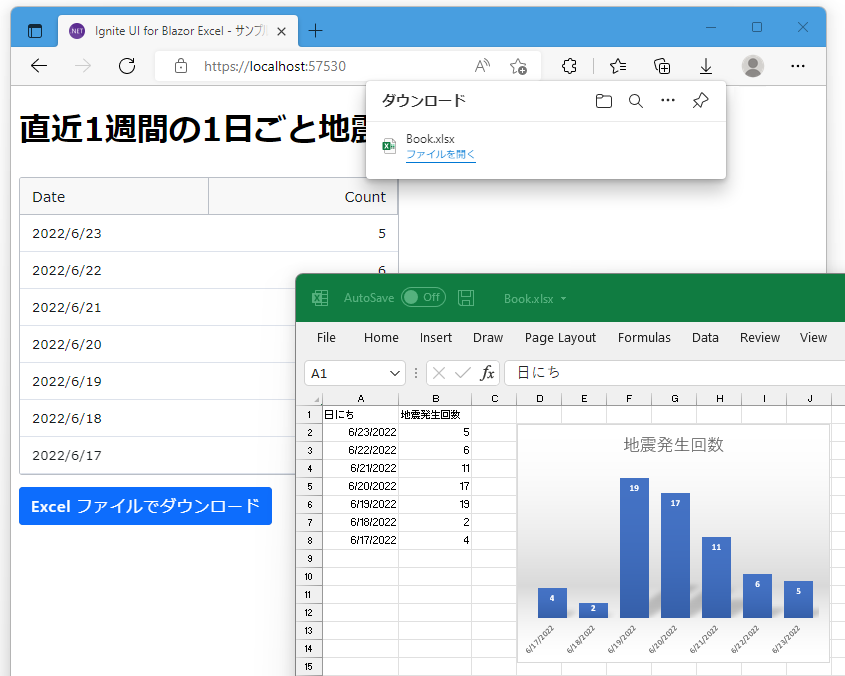

# Blazor WebAssembly 上で Excel ファイルを読み書きし、サーバー負荷を減らす

## 概要

このリポジトリは、インフラジスティックス・ジャパン株式会社 Blog の下記記事で紹介しているサンプルアプリケーションのソースコード一式です。

[📢 Blazor WebAssembly 上で Excel ファイルを読み書きし、サーバー負荷を減らす](https://blogs.jp.infragistics.com/entry/generate-xlsx-on-blazor-wasm)

[インターネット上の気象庁防災情報 XML サービス](https://www.data.go.jp/data/dataset/mlit_20170902_0034/resource/de72cea0-a658-4c64-987c-38effeca3eb8)から取得したデータに基づき、直近7日間に発生した1日ごとの地震発生回数を、Excel の表にしてダウンロードできる Blazor WebAssembly アプリケーションになります。

## Ignite UI for Blazor のライセンスをお持ちでない場合はトライアル版でご試用ください

このリポジトリに収録されているソースコードをビルド、実行するにあたり、Ignite UI for Blzor のライセンスをお持ちでない場合は、30 日間のサポート付きトライアル版への登録が必要です。  
トライアル版のダウンロードは、下記リンク先のフォームに必要事項を記入頂くことで可能です。

[🚀 Ignite UI for Blazor
無料トライアル版のダウンロード](https://jp.infragistics.com/products/ignite-ui-blazor/download)